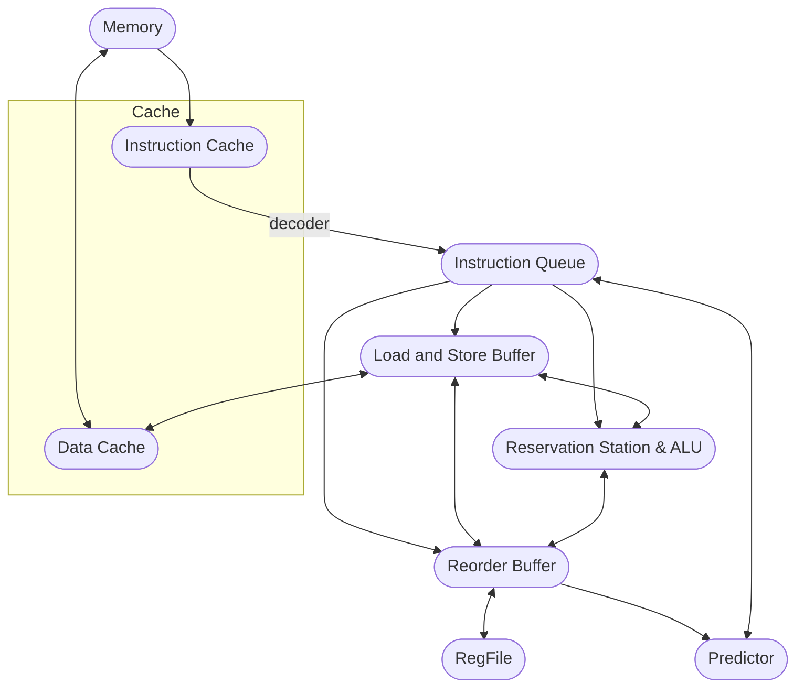

# CPU module design

## Diagram

## Components
部件名称、功能和基本执行逻辑。
### Cache
- 包括instruction cache和data cache，前者仅供读取指令，后者可被读写。
- 可能会采用直接映射
### Instruction Queue
- 存储从ICache fetch出的指令并解码，顺序发射，同时根据Predictor决定PC值
### Reorder Buffer
- 重排序缓存（RoB）的目的是让乱序执行的指令被顺序地提交
- 队列存储指令，按顺序commit，一次commit一条，commit后修改register的值
- 控制分支预测失败的回滚
- 监听RS、LSB的 broadcast
### Reservation Station
- 乱序执行
- 监听ALU、RoB、LSB的 broadcast
### Load and Store Buffer
- 队列存储指令，按顺序commit
- 监听RoB、RS的 broadcast
### RegFileI
- Issue时用rob的entry tag进行重命名
- 只与RoB交互（
### Predictor
- 用于分支预测，预测接下来会跳转的分支